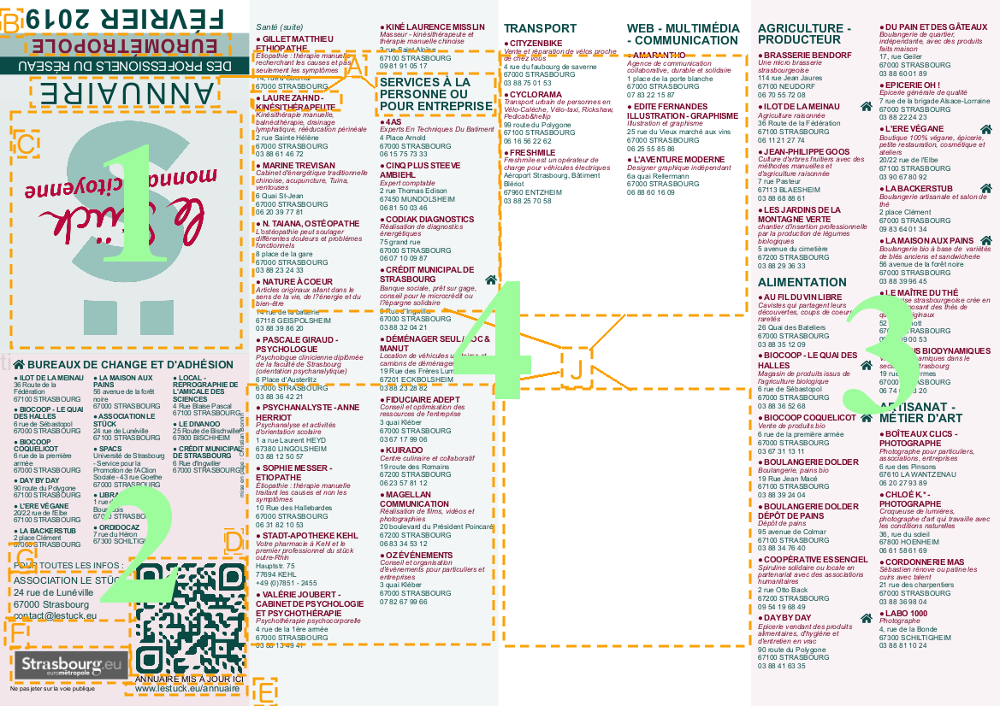

# Génération d'annuaire papier
Ce projet a pour but la génération d'annuaires papier au format PDF à partir de données au format CSV provenant par exemple d'une exportation par Dolibarr.
Il est constitué de :

* fichiers annuaire vierges au format Scribus (.sla)
* script python exécuté par Scribus pour remplir le document
* fichier de paramétrage au format CSV permettant de personnaliser le document
* images à importer dans le document
* données au format CSV
## Résultat

Eléments paramétrables : 

A. les trois couleurs utilisées dans le document
B. le texte du bandeau
C. le logo principal : fichier `logo.png`
D. le QRcode : fichier `qrcode.png`
E. adresse internet de l'annuaire
F. le petit logo : fichier `petitLogo.png`
G. adresse de l'association
H. les adresses des professionnels : fichier demandé à l'exécution du script
I. les adresses des bureaux de changes sont les professionnels dont le champ Bureau de change est à 1
J. Images pour remplir les espaces sans adresse : fichiers `image1.png`, `image2.png`, `image3.png`, `image4.png`

Une fois plié en huit, la partie 1 se retrouve devant et la partie 2 derrière. En dépliant une fois, la partie 3  apparait en premier et contient les deux premières colonnes de texte. La suite est au verso et la partie 4 contient les quatre dernières colonnes.

## Rôle des fichiers
### Données
C'est un fichier CSV avec la virgule (,) comme séparateur et les guillements (") comme délimiteurs facultatifs de champs
Les colonnes peuvent être dans le désordre, le script les reconnaît en cherchant les mots en gras (non sensible à la casse) :

* __nom__ du professionnel
* __Adresse__
* Code __postal__
* __Ville__
* __EMail__
* Télé**phone** professionnel 
* __Domaine__ d'activité Principal (catégorie)
* __Description__ de l'activité de l'entreprise
* __Latitude__
* __Longitude__
* Bureau de __change__ (contient 0 ou 1)

La colonne Domaine (ou catégorie) contient un numéro qui doit se trouver avec sa description dans le fichier `categorie.csv`
Son contenu est le suivant : 
```
"Catégorie","Numéro"
"...", <numéro>
...
```
### Sélection des professionnels
Lorsque le nombre de professionnels dépasse 150, une sélection doit être faite et plusieurs annuaires générés.

### Paramètrage
Le fichier CSV `parametres.csv` permet de paramétrer :
* les 3 couleurs utilisées dans le document en donnant leurs composantes quadrichromiques (Cyan, Magenta, Jaune, Noir).
    * couleurBandeau
    * couleurSombre
    * couleurTitre
* txtBandeau : le texte du bandeau
* txtUrlAnnuaire : l'URL sous le QRcode
* txtInfoAsso : adresse de l'association
* filtreGeo : sélection en fonction des codes postaux ou d'un polygone géographique

### Fichiers annuaire vierges
les fichiers `A4-150.sla` et `A4-140.sla` ne contiennent pas d'adresses de professionnels, les images et quelques informations présentes seront remplacées à l'exécution du script. Le premier fichier génère un annuaire de taille A4 pouvant contenir environ 150 adresses de professionnels. Dans le second, les adresses sont écrites un peu plus gros.
Ils NE DOIVENT PAS ÊTRE MODIFIÉS. Sauvegardez-les sous un autre nom si vous souhaitez enregistrer un annuaire rempli au format Scribus.

## Génération des annuaires
### Pré requis
1. Le logiciel [Scribus](https://www.scribus.net) doit être installé (version utilisée pour ce projet : 1.4.7)
1. Quelques symboles de la police [Fontawesome](https://fontawesome.com/how-to-use/on-the-desktop/setup/getting-started) sont utilisés

### Génération
1. Ouvrez le fichier `A4-150.sla` (ou `A4-140.sla`)
1. Avec la commande du menu Script > Démarrer un script..., lancez le script `importerPros.py`
1. Indiquez le fichier CSV contenant les doonnées à importer (ex. : `export_societe.csv`)
1. Un message rappelle les autres fichiers utilisés devant être présents dans le même répertoire. Cliquez sur OK
1. La barre d'état de Scribus indique quelle zone de texte est actuellement en cours de remplissage, la barre de progression indique l'avancement dans la liste complète des adresses
1. Un message apparaît après chaque zone de texte. Attention il peut être caché sous une autre fenêtre. Ils permettent de contourner un bug de Scribus qui reste bloqué lorsque trop d'instructions lui sont envoyées
1. Une fois l'annuaire complètement rempli, il est possible de modifier le résultat avant d'exporter
1. Dans le menu Fichier > Exporter > Enregistrer en PDF..., ignorez les erreurs et choisissez le fichier PDF de destination
